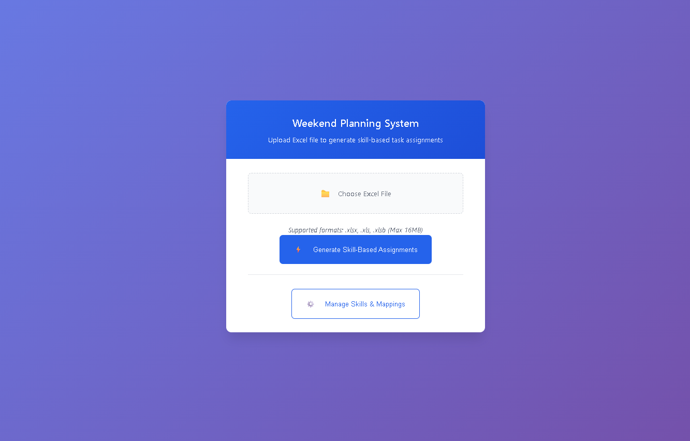
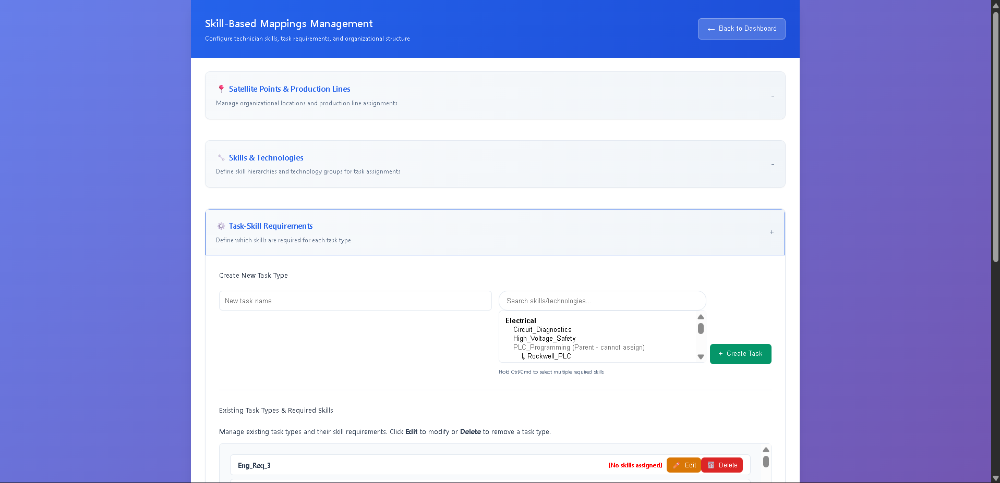
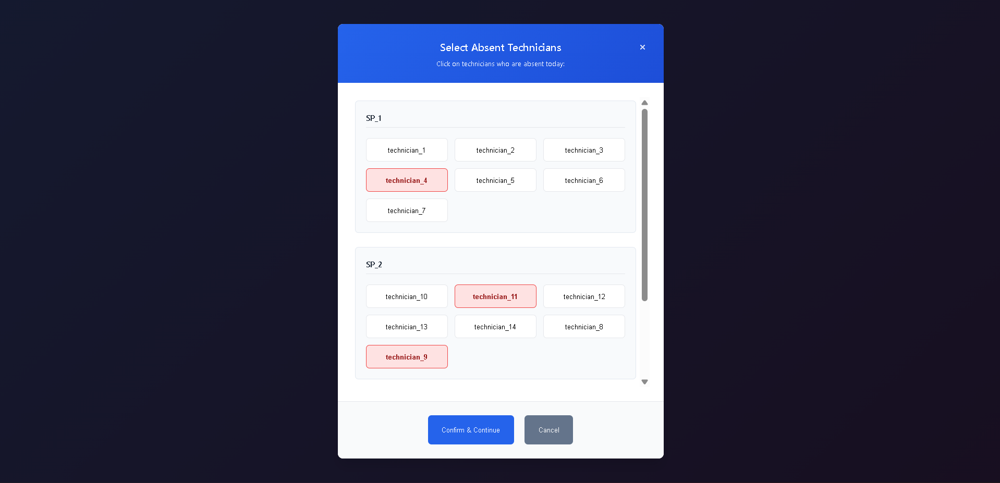
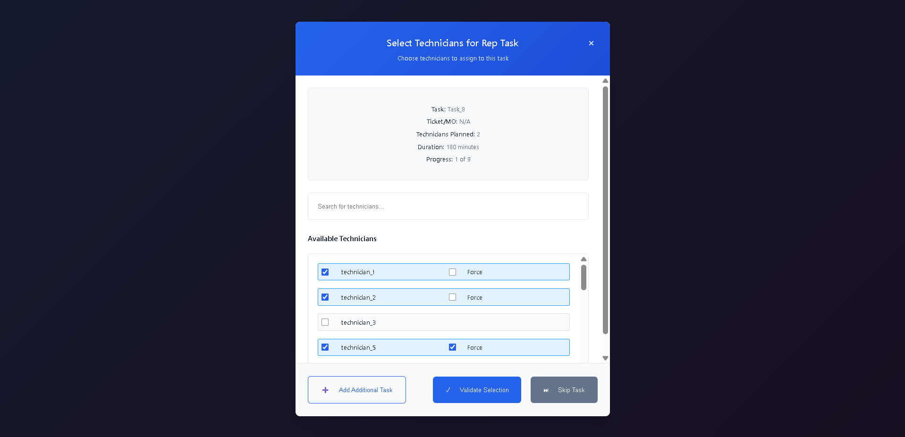
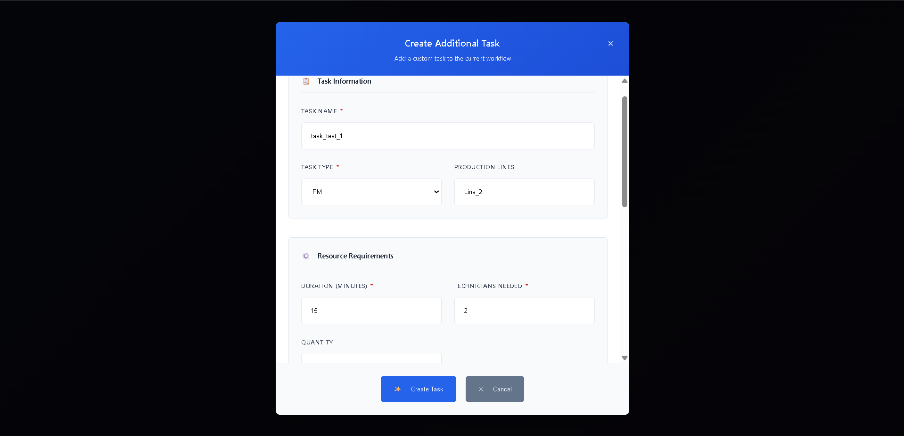
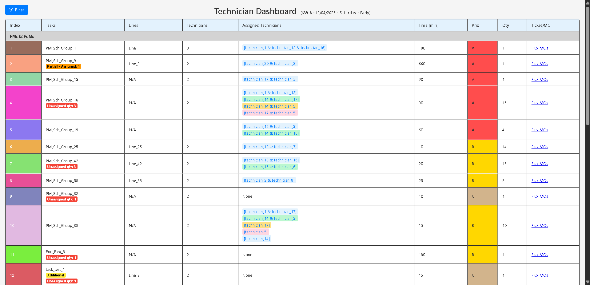
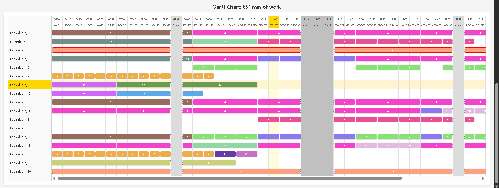

# Workforce Manager

A professional Flask-based web application for managing weekend technician task assignments using skill-based matching and workload optimization.

## 🚀 Features

- **Advanced Skill-Based Matching:** Intelligent task assignment system matching technician skills with task requirements
- **Multi-Skill Task Support:** Tasks can require multiple technical skills with different proficiency levels
- **Group Assignment Logic:** Smart grouping of technicians to optimize skill coverage and team effectiveness
- **Technician Management:** Comprehensive technician profiles with skill tracking and experience levels
- **Task Management:** Create, update, and manage tasks with multi-skill requirements and duration calculations
- **Interactive Dashboard:** User-friendly interface for managing assignments and viewing technician workloads
- **Security Features:** CSRF protection, input validation, rate limiting, and secure headers
- **Excel Integration:** Import and process technician data and skill matrices from Excel files
- **Real-time Updates:** Dynamic skill mapping and assignment optimization
- **Workload Balancing:** Automatic adjustment of task duration based on team size and skill levels

## 🖼️ Screenshots

Here's a glimpse of the Workforce Manager in action:

| Main Page | Manage Mappings |
| :---: | :---: |
| *Users can upload Excel files and initiate the assignment process.* | *A dedicated UI for managing technicians, skills, and tasks.* |
|  |  |

| Absent Technicians Modal | REP Task Assignment |
| :---: | :---: |
| *Easily mark technicians as absent before generating the schedule.* | *Manually assign high-priority REP tasks to eligible technicians.* |
|  |  |

| Additional Task Creation | Technician Dashboard - Table View |
| :---: | :---: |
| *Dynamically add new tasks during the assignment process.* | *A clear, tabular view of the final schedule for each technician.* |
|  |  |

| Technician Dashboard - Gantt Chart View |
| :---: |
| *An interactive Gantt chart visualizes the entire weekend schedule.* |
|  |

## 📁 Project Structure

```
WorkforceManager/
├── src/                     # Main application package
│   ├── routes/              # Flask blueprints and routing
│   ├── services/            # Business logic and utilities
│   ├── static/              # CSS, JavaScript, and static assets
│   ├── templates/           # Jinja2 HTML templates
│   └── app.py               # Flask application factory
├── instance/                # Instance folder for database
│   ├── workforce_manager.db  # Production database
│   └── testsDB.db           # Test database
├── logs/                    # Application and error logs
├── output/                  # Generated output files
├── docs/                    # Documentation
│   └── assets/              # Image assets for documentation
├── docker/                  # Docker configuration
├── tests/                   # Tests
├── test_data/               # Test data
├── .gitignore
├── requirements.txt
├── run.py
└── README.md
```

## ⚙️ Setup and Installation

### Prerequisites

- Python 3.12 or higher
- pip (Python package installer)
- Git

### Installation Steps

1. **Clone the repository:**
   ```bash
   git clone <repository-url>
   cd WorkforceManager
   ```

2. **Create a virtual environment:**
   ```powershell
   py -3 -m venv .venv
   ```
   This creates a `.venv` directory in your project root.

   **Activate the virtual environment:**
   - On **Windows (PowerShell)**:
     ```powershell
     .\.venv\Scripts\Activate.ps1
     ```
   - On **Windows (Command Prompt)**:
     ```cmd
     .venv\Scripts\activate
     ```
   - On **macOS/Linux (bash/zsh):**
     ```bash
     source .venv/bin/activate
     ```

   > **If you encounter issues with the virtual environment or Python interpreter in PyCharm:**
   > - Delete the `.venv` folder.
   > - Repeat the steps above to recreate and activate the environment.

3. **Install dependencies:**
   ```bash
   pip install -r requirements.txt
   ```

4. **Set the Python interpreter in PyCharm:**
   - Go to `File > Settings > Project: <your_project> > Python Interpreter`.
   - Click the gear icon > `Add...` > `Existing environment`.
   - Browse to `.venv\Scripts\python.exe` and select it.
   - If you see `[invalid]` next to the interpreter, try restarting PyCharm. If the issue persists, delete the `.venv` folder and repeat steps 2–4.

5. **Set up environment variables:**
   Create a `.env` file in the project root by copying the `.env.example` file. This is recommended for setting debug flags and other configurations.
    ```bash
    cp .env.example .env
    ```
   Then, edit the `.env` file as needed.

6. **Initialize the database:**
   The database will be automatically initialized on the first run.

7. **Run the application:**
   ```bash
   python run.py
   ```

8. **Access the application:**
   Open your browser and navigate to `http://127.0.0.1:5000`

---

**Note for PyCharm users:**  
If you encounter issues with the Python interpreter showing as `[invalid]`, ensure the virtual environment was created with the correct Python version, and that you have activated it before installing dependencies. Restarting PyCharm often resolves interpreter detection issues.

## 🚀 Testing Guide

The testing process involves two main stages: automatic data population from a JSON file, followed by manual data import from Excel files.

### Stage 1: Automatic Dummy Data Population

This first stage provides the foundational data for the application (technicians, skills, tasks, etc.).

1.  **Enable Test Database Mode**: In your `.env` file, ensure the following variable is set:
    ```env
    DEBUG_USE_TEST_DB=1
    ```

2.  **Delete the Old Test Database (First Time Only)**: If you have previously run the application, delete the `testsDB.db` file located in the `instance/` directory. This ensures a fresh database is created.

3.  **Run the Application**: Start the application from the project root:
    ```bash
    python run.py
    ```
    On the first run with these settings, the application will automatically create a new test database (`testsDB.db`) and populate it with the contents of `dummy_data.json`.

### Stage 2: Testing with Excel Files

After the initial data has been loaded, you can test the application's data import and processing capabilities.

1.  **Navigate to the Main Page**: Open your browser and go to `http://127.0.0.1:5000/`.
2.  **Import Sample Data**:
    *   Use the file upload functionality on the page to import `testsExcel.xlsb` and `testsExcel2.xlsb` from the `test_data/` directory.
    *   This will add to or modify the initial data in the database.
3.  **Run Task Assignment**:
    *   Once the data is imported, you can trigger the task assignment process from the UI.
    *   The application will use its skill-based algorithm to assign the tasks to the most suitable technicians.
4.  **View the Dashboards**:
    *   **Supervisor Dashboard**: Navigate to the supervisor dashboard to get an overview of all task assignments, schedules, and workloads.
    *   **Technician Dashboard**: Check the individual technician dashboards to see their specific schedules and assigned tasks.

### Testing with a Fixed Date

For consistent testing of scheduling logic, you can force the application to use a fixed date and time for all calculations.

- **Set the Fixed Date**: Add the `DEBUG_FIXED_DATE` variable to your `.env` file. The value should be in ISO format (e.g., `YYYY-MM-DD` or `YYYY-MM-DDTHH:MM:SS`).

  ```env
  # Example: Set the date to April 19, 2025, at 4:00 PM
  DEBUG_FIXED_DATE=2025-04-19T16:00:00
  ```
- If `DEBUG_FIXED_DATE` is not set, the application will default to a canonical test date (`2025-04-19 16:00:00`) when in debug mode.

## 🔧 Configuration

### Environment Variables

| Variable | Description | Default |
|----------|-------------|---------|
| `SECRET_KEY` | Flask secret key for sessions | Auto-generated |
| `FLASK_DEBUG` | Enable debug mode (1/true/yes) | 0 |
| `DEBUG_USE_TEST_DB` | Force use of test database and load dummy data | 0 |
| `DEBUG_FIXED_DATE` | Fixed date for testing (ISO format) | `2025-04-19T16:00:00` (in debug) |
| `DATABASE_FILENAME` | Custom database filename | Based on debug mode |
| `CSRF_TIME_LIMIT` | CSRF token expiration (seconds) | 3600 |
| `SESSION_LIFETIME` | Session timeout (seconds) | 1800 |
| `MAX_UPLOAD_SIZE` | Maximum file upload size (bytes) | 16777216 |
| `MIN_SKILL_LEVEL` | Minimum required skill level | 1 |
| `MAX_SKILL_LEVEL` | Maximum possible skill level | 5 |

## 📊 Skill-Based Assignment System

The application uses a sophisticated skill-based assignment system that:
- Matches technicians to tasks based on required technical skills
- Supports multiple skill requirements per task
- Calculates optimal team sizes based on task complexity
- Adjusts task duration based on team composition
- Ensures fair workload distribution while maintaining skill coverage

## 🔒 Security

- CSRF Protection for all forms
- Input validation and sanitization
- Rate limiting on API endpoints
- Secure session handling
- XSS prevention
- Secure file upload handling

## 📝 Documentation

Detailed documentation is available in the `docs/` directory.

## 🎯 Usage

### Web Interface

1. **Dashboard Access:** Navigate to the main dashboard to view technician assignments
2. **Manage Mappings:** Use the mappings interface to configure:
   - Technician skills and competency levels (0-4)
   - Task requirements and multi-skill dependencies
   - Satellite points and line assignments
3. **File Upload:** Import Excel files with technician and task data
4. **Assignment Generation:** Generate optimized task assignments based on skills

### API Endpoints

The application provides REST API endpoints for programmatic access:

- `GET /api/technicians` - Retrieve all technicians
- `GET /api/get_technician_mappings` - Get technician skill mappings
- `POST /api/tasks` - Create or update tasks
- Additional endpoints available in `/routes/api.py`

## 🛡️ Security Features

- **CSRF Protection:** All forms protected against cross-site request forgery
- **Input Validation:** Comprehensive server-side validation and sanitization
- **Rate Limiting:** API endpoints protected against abuse
- **Secure Headers:** Security headers automatically added to responses
- **Session Management:** Secure session handling with configurable timeouts

## 🔍 Development

### Key Components

1. **Task Assignment Algorithm:** Skill-based matching with workload optimization
2. **Database Schema:** Normalized design supporting many-to-many relationships
3. **Security Layer:** Multi-layered security with validation and sanitization
4. **Configuration Management:** Environment-aware configuration system

### Code Quality

- **PEP 8 Compliance:** Python code follows PEP 8 styling guidelines
- **Class-based Architecture:** Modern object-oriented design patterns
- **Error Handling:** Comprehensive error handling and logging
- **Documentation:** Well-documented code with clear docstrings

## 📊 Database Schema

The application uses SQLite with the following key tables:

- `technicians` - Technician profiles and satellite point assignments
- `technologies` - Available technologies and skills
- `tasks` - Task definitions
- `technician_technology_skills` - Technician skill levels (0-4)
- `task_required_skills` - Task skill requirements
- `technician_task_assignments` - Final task assignments

When `DEBUG_USE_TEST_DB` is enabled, this schema is automatically populated from `dummy_data.json` on the first run.

## 🚨 Troubleshooting

### Common Issues

1. **Database Errors:** Ensure the database directory is writable
2. **Import Errors:** Verify all dependencies are installed
3. **Configuration Issues:** Check environment variables and file paths
4. **Security Warnings:** Ensure SECRET_KEY is set in production

### Logging

Application logs are available in the `logs/` directory with different log levels for debugging.

## 🤝 Contributing

1. Follow PEP 8 coding standards
2. Write comprehensive tests for new features
3. Update documentation for any changes
4. Ensure all security validations are in place

## 📝 License

This project is licensed under the MIT License. See the `LICENSE` file for details.

---

**Version:** 1.2.0  
**Last Updated:** September 2025
